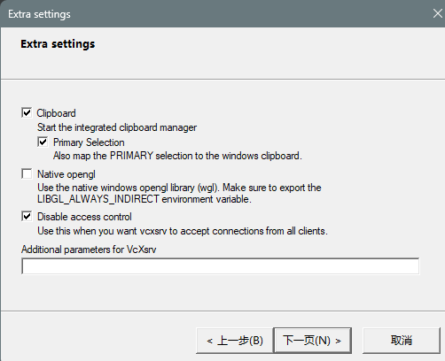
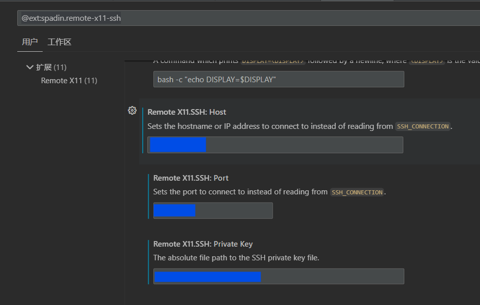
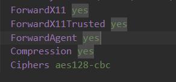

# Remote Development

When developing on a remote machine(e.g. using VSCode remote), OpenGL rendering could not output on your machine directly. To achieve this, you may need X11 forwarding(better than Remote Desktop).

This documentation shows the process to setup X11 forwarding in VSCode (***Windows only***).

### 1. download client side application:

Download the [VcXsrv Windows X Server](https://sourceforge.net/projects/vcxsrv/) and install it on your ***Local Machine***. You can also use other X11 server applications.

### 2. launch `XLaunch` 
    
1. find XLaunch on your PC

2. select `multiple windows` and set your customized display number (I set `10` here) 

3. keep clicking `next`

4. !***Important***!:

 * Select `Disable access control`
 * Unselect `Native OpenGL`

5. finally you should be able to see an icon on your tray 

### 3. install plugins:
    
- `Remote - X11` on your ***Remote Dev Machine***! 
- `Remote X11 (SSH)` on your ***Local Machine***!

Do not install both on a single side.

### 4. Remote Configuration:

On your ***Remote Machine***, set environment variable `DISPLAY` to `localhost:{your custom display num}.{your screen num}`

e.g. for linux, add

- `export DISPLAY=localhost:10.0`
- `export LIBGL_ALWAYS_INDIRECT=`

into `~/.bashrc` and call `source ~/.bashrc` to refresh the terminal.

After that, connect to your remote machine with VSCode and modify the `Remote X11` settings. Input the `Display number`
as the same as the one you set in `XLaunch` (I set `10` here).

### 5. Client Side Configuration:

On your ***Local Machine***, open VSCode and config for `Remote X11(SSH)`. Modify the `host`, `port` & `private key` so as to connect to your ***Remote Machine***.

### 6. Connect

You should be able to use VSCode to develop on your ***Remote Machine*** now. Try to run `xclock` in remote terminal, and you will get a window on your ***Local Machine*** like this:

### 7. Speed Up

You may facing to slow speed with X11. For speeding up, you could do the following setting:

 * Change SSH `Ciphers` to faster algorithms(e.g. aes128-cbc). If you are using vscode, you can add line `Ciphers aes128-cbc` under your connection config.

 * Use `compression` to speed up the data transfer(known as arg `-C`). Add line `Compression yes` under your connection config.

The following shows an vscode setting example:

  

If it is still too slow, consider use other remote development methods, such as x2go.